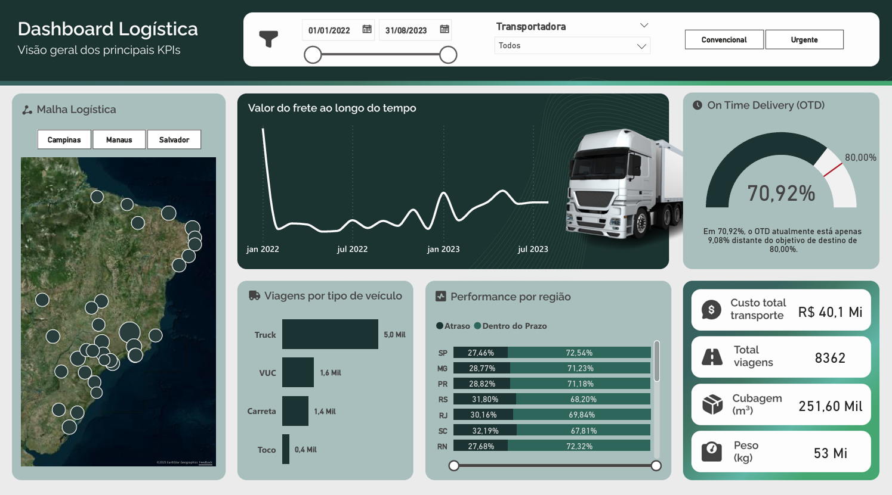

# 🚚 Dashboard — Otimização de Operações Logísticas

Análise de distribuição e fluxos operacionais para redução de gargalos logísticos.

---

## 🎯 Objetivo

Analisar a distribuição e os fluxos operacionais do transporte rodoviário para identificar gargalos logísticos, monitorar o cumprimento de prazos e apoiar decisões estratégicas de roteirização.

---

## 📊 KPIs Monitorados

| Indicador | Valor |
|---|---|
| **On Time Delivery (OTD)** | 70,92% (meta: 80%) |
| **Custo Total de Transporte** | R$ 40,1 Mi |
| **Total de Viagens** | 8.362 |
| **Cubagem** | 251,60 Mil m³ |
| **Peso Total** | 53 Mi kg |

---

## 🔍 Análises Disponíveis

- **Malha Logística** — mapa interativo com pontos de entrega por cidade (ArcGIS/Esri), com filtro por hub (Campinas, Manaus, Salvador)
- **Valor do Frete ao longo do tempo** — evolução temporal do custo de frete
- **On Time Delivery** — gauge com comparativo vs. meta de 80%
- **Viagens por tipo de veículo** — Truck, VUC, Carreta, Toco
- **Performance por região** — % Atraso vs. Dentro do Prazo por UF (SP, MG, PR, RS, RJ, SC, RN)
- **Filtros** — por período, transportadora e tipo de entrega (Convencional/Urgente)

---

## 🗂️ Modelagem de Dados

Modelo com 2 tabelas:

| Tabela | Tipo | Campos principais |
|---|---|---|
| **Histórico Transporte** | Fato | Cubagem (m³), Data de Coleta, Data de Entrega, Destino-Cidade, Destino-UF, Diferença, Load, Meta OTD, Origem-Cidade, Origem-UF, OTD, Peso Bruto (kg), Prazo Contratual, Prazo Realizado, Qtd no Prazo, Status Transporte, Total Viagens, Transportadora |
| **Valor do Frete** | Dimensão | Valor do Frete, Load, Tipo de Veículo, Tipo Transporte |

---

## 🐍 Python no Power Query

A coluna **"Status Transporte"** foi gerada via script Python integrado ao Power Query, classificando automaticamente cada entrega como **"Dentro do Prazo"** ou **"Atraso"** com base na diferença entre prazo contratual e prazo realizado.

A query **"Histórico Python"** evidencia essa transformação, demonstrando uso de Python para automação de classificação de dados dentro do Power BI.

---

## 📐 Medidas DAX

| Medida | Descrição |
|---|---|
| `OTD` | % de entregas dentro do prazo |
| `Meta OTD` | Meta de On Time Delivery (80%) |
| `Qtd no Prazo` | Contagem de entregas no prazo |
| `Total Viagens` | Total de viagens no período |

---

## 🛠️ Tecnologias

